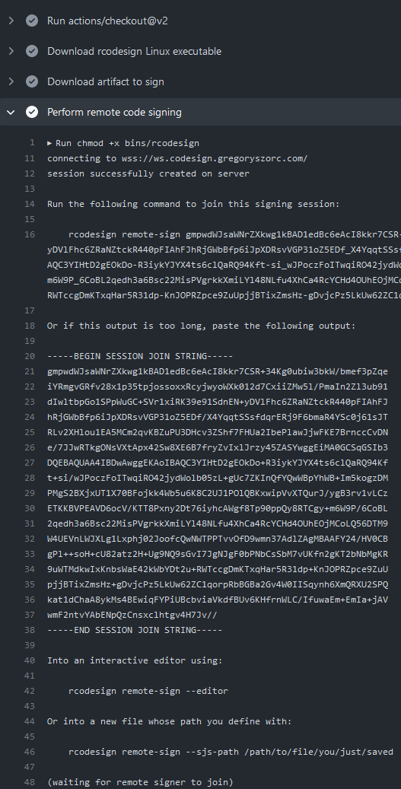
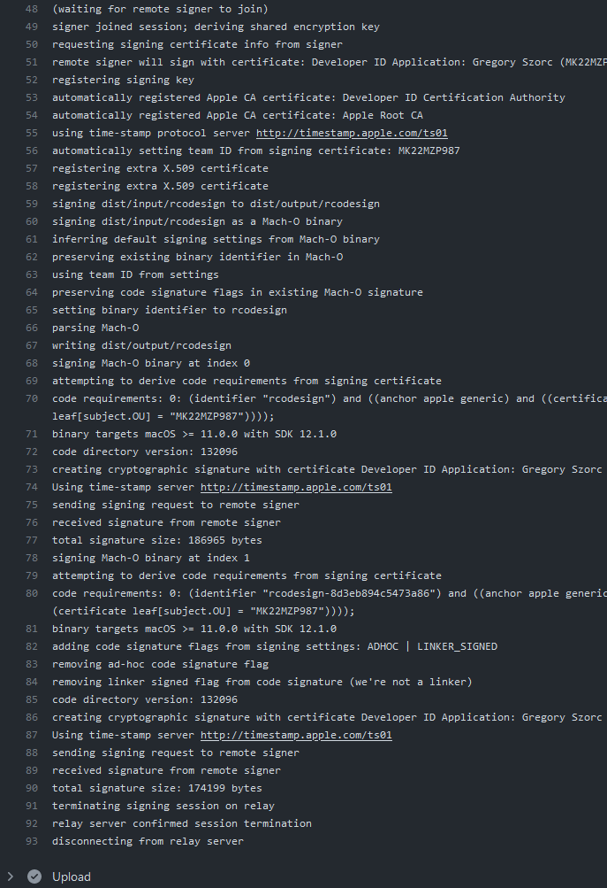
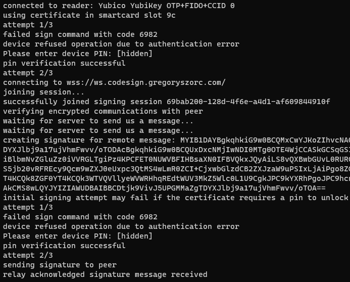

.. _apple_codesign_remote_signing:

===================
Remote Code Signing
===================

This project has support for *remote signing*. This is a feature where
cryptographic signature operations (requiring access to the private key)
are delegated to a remote machine.

From a high level, two machines establish a secure communications bridge with
each other through a central server. The *initiating* machine starts signing
operations like normal. But when it gets to an operation that requires producing
a cryptographic signature, it sends an end-to-end encrypted message to the
bound *signer* peer with the message to sign. The *signer* then uses its
private key to create a signature, which it sends back to the *initiator*,
who incorporates it into the code signature.

Remote signing is essentially peer-to-peer, not client-server. The central
server exists for relaying encrypted messages between peers and not for
performing signing operations itself. Each signing *session* is ephemeral
and short-lived. Since the signing keys are offline by default and a human must
take action to join a signing session and use the signing keys, remote signing
is theoretically more secure than solutions like giving a (CI) machine
unlimited access to a code signing certificate or HSM.

Remote signing is intended for use cases where the machine initiating signing
must not or can not have access to the private key material or unlimited
access to it. Popular scenarios include:

* CI environments where you don't want a CI worker to have unlimited access
  to the signing key because CI workers are notoriously difficult to secure.
  (If someone can run arbitrary jobs on your CI they can likely exfiltrate any
  CI secrets with ease.)
* When hardware security devices are used and machines initiating the signing
  don't have direct access to this device. Think a remote CI machine or
  coworker wanting to sign with a certificate in a YubiKey or HSM whose
  access is entrusted to a specific person (or group of people in the case of
  an HSM).

.. important::

   This feature is considered alpha and will likely change in future versions.

.. danger::

   The custom cryptosystem for remote signing has not yet undergone an audit.
   The end-to-end message encryption and tampering resistance claims we've
   made may be undermined by weaknesses in the design of the cryptosystem and
   its implementation and interaction in code.

   In other words, use this feature at your own risk.

   `Issue 552 <https://github.com/indygreg/PyOxidizer/issues/552>`_ tracks
   performing an audit of this feature.

How It Works
============

A full overview of the protocol and cryptography involved is available at
:ref:`apple_codesign_remote_signing_protocol` and you can read more about the
design and security at :ref:`apple_codesign_remote_signing_design`.

From a high-level, signing operations involve 2 parties:

* The *initiator* of the signing request. This is the entity that wants
  something to be signed but doesn't having the signing certificate / key.
* The *signer*. This is the entity who has access to the private signing key.

The signing procedure is essentially:

1. *Initiator* opens a persistent websocket to a central server and publishes
   details about that session and how to connect to it.
2. *Signer* follows the instructions from *initiator* and joins the *signing
   session* by opening a websocket to the same server as the *initiator*.
   Cryptography is employed to derive encryption keys so all subsequently
   exchanged messages are end-to-end encrypted, preventing the server or any
   privileged network actors from eavesdropping on signing operations or forging
   a signing request.
3. *Initiator* sends a request to *signer* asking them to sign a message.
4. *Signer* inspects the request and issues a cryptographic signature, which it
   sends back to *initiator*.
5. Steps 3-4 are repeated as long as necessary.

Using
=====

The *initiator* begins a remote signing *session* via ``rcodesign sign
--remote-signer``. (Some additional arguments are required - see below.)

This command will print out an ``rcodesign`` command that the *signer* must
subsequently run to *join* the signing session. e.g.::

    $ rcodesign sign --remote-signer --remote-shared-secret-env SHARED_SECRET
    ...
    connecting to wss://ws.codesign.gregoryszorc.com/
    session successfully created on server
    Run the following command to join this signing session:

    rcodesign remote-sign gm1zaGFyZWRzZWNyZXQwg...

    (waiting for remote signer to join)

At this point, that long opaque string - which we call a *session join string* -
needs to be copied or entered on the *signer*. e.g.::

    $ rcodesign remote-sign --p12-file developer_id.p12 --remote-shared-secret-env SHARED_SECRET \
       gm1zaGFyZWRzZWNyZXQwg...

If everything goes according to plan, the 2 processes will communicate with
each other and *initiator* will delegate all of its signing operations to
*signer*, who will issue cryptographic signatures which it sends back to the
*initiator*.

Session Agreement
=================

Remote signing currently requires that the *initiator* and *signer* exchange
and agree about *something* before signing operations. This ahead-of-time
exchange improves the security of signing operations by helping to prevent
signers from creating unwanted signatures.

The sections below detail the different types of agreement and how they are
used.

Public Key Agreement
====================

.. important::

   This is the most secure and preferred method to use.

In this operating mode, the *signer* possesses a private key that can decrypt
messages. When the *initiator* begins a signing operation, it encrypts a message
that only the *signer*'s private key can decrypt. This encrypted message is
encapsulated in the *session join string* exchanged between the *initiator* and
*signer*.

This mode can be activated by passing one of the following arguments defining
the public key:

``--remote-public-key``
   Accepts base64 encoded public key data.

   Specifically, the value is the DER encoded SubjectPublicKeyInfo (SPKI)
   data structure defined by RFC 5280.

``--remote-public-key-pem-file``
   The path to a file containing the PEM encoded public key data.

   The file can begin with ``-----BEGIN PUBLIC KEY-----`` or
   ``-----BEGIN CERTIFICATE-----``. The former defines just the SPKI data
   structure. The latter an X.509 certificate (which has the SPKI data
   inside of it).

Both the public key and certificate data can be obtained by running the
``rcodesign analyze-certificate`` command against a (code signing) certificate.

The *signer* needs to use the corresponding private key specified by the
*initiator* in order to join the signing session. By default, ``rcodesign
remote-sign`` attempts to use the in-use code signing certificate for
decryption.

So, an end-to-end workflow might look like the following:

1. Run ``rcodesign analyze-certificate`` and locate the
   ``-----BEGIN PUBLIC KEY-----`` block.
2. Save this to a file, ``signing_public_key.pem``. You can check this file into
   source control - the contents aren't secret.
3. On the initiator, run ``rcodesign sign --remote-signer
   --remote-public-key-pem-file signing_public_key.pem /path/to/input
   /path/to/output``.
4. On the signer, run ``rcodesign remote-sign --smartcard-slot 9c
   ``<session join string>``.

We believe this method to be the most secure for establishing sessions because:

* The state required to bootstrap the secure session is encrypted and can only
  be decrypted by the private key it is encrypted for. If you are practicing
  proper key management, there is exactly 1 copy of the private key and access
  to the private key is limited. This means you need access to the private key
  in order to compromise the security of the signing session.
* The session ID is encrypted and can't be discovered if the session join string
  is observed. This eliminates a denial of service vector.

Shared Secret Agreement
=======================

.. important::

   This method is less secure than the preferred *public key agreement* method.

In this operating mode, *initiator* and *signer* agree on some shared secret
value. A password, passphrase, or some random value, such as a type 4 UUID.

This mode is activated by passing one of the following arguments defining the
shared secret:

``--remote-shared-secret-env``
   Defines the environment variable holding the value of a shared secret.

``--remote-shared-secret``
   Accepts the raw shared secret string.

   This method is not very secure since the secret value is captured in plain
   text in process arguments!

An end-to-end workflow might look like the following:

1. A secure, random password is generated using a password manager.
2. The secret value is stored in a password manager, registered as a CI secret,
   etc.
3. The initiator runs ``rcodesign sign --remote-signer --remote-shared-secret-env
   REMOTE_SIGNING_SECRET /path/to/input /path/to/output``.
4. The signer runs ``rcodesign remote-sign --remote-shared-secret-env
   REMOTE_SIGNING_SECRET --smartcard-slot 9c``.

Important security considerations:

* Anybody who obtains the shared password could coerce the signer into signing
  unwanted content.
* Weak password will undermine guarantees of secure message exchange and could
  make it easier to decrypt or forge communications.

Because the password exists in multiple locations, must be known by both
parties, and the process for generating it are not well defined, the overall
security of this solution is not as strong as the preferred *public key
agreement* method. However, this method is easier to use and may be preferred
by some users.

.. _apple_codesign_remote_signing_github_actions:

Using with GitHub Actions
=========================

It is pretty simple to initiate remote code signing from GitHub Actions! In
fact, this scenario is one of the primary use cases for the design of the
feature.

.. note::

   `Issue #553 <https://github.com/indygreg/PyOxidizer/issues/553>`_ tracks
   publishing a canonical GitHub Action that formalizes the steps in this
   documentation. Assistance in building that would be greatly appreciated!

Here are the general steps.

Configuring a Workflow / Actions
--------------------------------

First, export the public key data of the signing certificate to a file
checked into source control. Use ``rcodesign analyze-certificate`` and
copy the ``-----BEGIN PUBLIC KEY----`` block to a file in your
repository. e.g. https://github.com/indygreg/PyOxidizer/blob/main/ci/developer-id-application.pem
defines the ``Developer ID Application`` public key data for the maintainer
of this project.

.. note::

   The public key data is included in the code signatures embedded in signed
   artifacts so there is generally not a concern with making the public key
   data widely available in the repository.

Next, create a GitHub workflow or action that invokes ``rcodesign sign``.
https://github.com/indygreg/PyOxidizer/blob/main/.github/workflows/sign-apple-exe.yml
is an example of such a workflow. This particular workflow is using
``on.workflow_dispatch`` so the workflow is only triggered manually. See
the `workflow_dispatch documentation <https://docs.github.com/en/actions/using-workflows/events-that-trigger-workflows#workflow_dispatch>`_
and `Manually running a workflow <https://docs.github.com/en/actions/managing-workflow-runs/manually-running-a-workflow>`_
docs for more.

.. important::

   A manually triggered workflow is strongly recommended because a signer must
   take manual action to perform remote signing and an automated trigger will
   likely hang unless a person is around to attend to it.

.. important::

   For security reasons, you should set ``timeout-minutes`` on either the job
   or step initiating remote signing to limit how long a signer will wait.

The important steps in a remote signing action/workflow are:

1. Securely obtain ``rcodesign``. We recommend downloading a release artifact
   from https://github.com/indygreg/PyOxidizer/releases and pinning/verifying
   the SHA-256 digest on download.
2. Download the artifact you want signed. The
   `Download workflow artifact <https://github.com/marketplace/actions/download-workflow-artifact>`_
   action can be useful for downloading artifacts from other workflows in the
   current repository (since the official ``download-artifact`` action limits
   you to artifacts in the current workflow).
3. Invoke ``rcodesign sign --remote-signer
   --remote-public-key-pem-file path/to/public_key.pem``.
4. Do something with the signed result (like upload it as an artifact).

Running the Workflow / Action
-----------------------------

Now that you have a GitHub workflow or action in place, here's how you use it.

If you followed the recommendations from above, the workflow is manually
triggered via ``on.workflow_dispatch``. You can trigger the workflow via
the GitHub web UI or via API. For API, the path of least resistance is likely
the ``gh`` `GitHub CLI <https://cli.github.com/>`_ tool. e.g.::

    gh workflow run sign-apple-exe.yml \
      --ref ci-main \
      -f workflow=rcodesign.yml \
      -f run_id=2214520041 \
      -f artifact=exe-rcodesign-macos-universal \
      -f exe_name=rcodesign

If your workflow is highly parameterized (like this one), you may want to
script its invocation to make it more turnkey.

When ``rcodesign sign --remote-signer`` runs in GitHub Actions, it will print
instructions on how to join the signing session. You will need to follow
these instructions in a timely manner to complete the code signing operation.

Here is what you are looking for in the job output:

Then, simply follow instructions on the machine with the signing key
to commence signing!

.. important::

   When you view the logs of a running GitHub Actions job, only the output
   from after the point you started viewing them is visible. This means that
   if you are *too late* you may not see the printed instructions for joining
   the signing session!

   There are definitely some mitigations we can take for this. For the moment,
   you need to be quick to open the job output in your browser. Or you can do
   things like add a ``sleep`` before running ``rcodesign sign``.

If all goes according to plan, you should see progress being printed
both in the signing process and from the near real time output from
GitHub Actions.

Here is the output from the GitHub Actions (Linux) machine:

And from the signing Windows machine using a YubiKey for signing:

